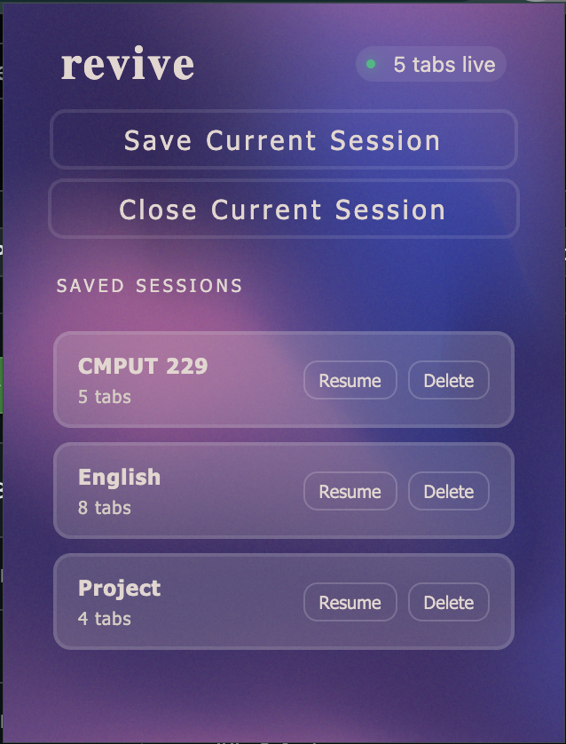
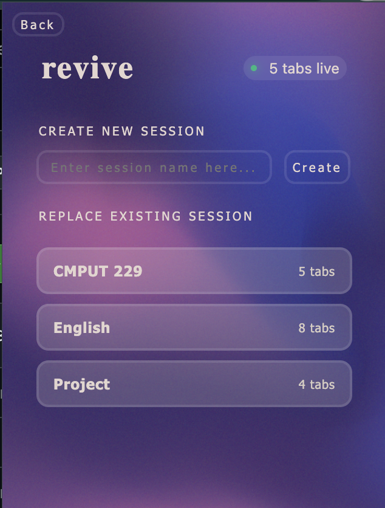

# Revive

A lightweight Chrome extension for saving, resuming, and managing browser tab sessions, so you can close a cluttered window guilt-free and pick it back up exactly where you left off.

## Features

- **Save Current Session** - capture every tab open in your current window as a named session
- **Close Current Session** - close all live tabs in one click after saving
- **Resume** - reopen a saved session's tabs instantly
- **Delete** - remove sessions you no longer need
- **Overwrite** - resume a session, make changes, and save it again under the same name to update it
- **Live tab count** - always see how many tabs are currently open at a glance

## Screenshots

Main Page:



Save Session:



## Installation

This extension isn't published on the Chrome Web Store, but you can still install and run it:

1. Clone or download this repository:
   ```bash
   git clone https://github.com/keyamalhotra007/Revive.git
   ```
2. Open Chrome and navigate to `chrome://extensions`
3. Enable **Developer mode** (toggle in the top-right corner)
4. Click **Load unpacked**
5. Select the folder where you cloned/downloaded this repo
6. The Revive icon will appear in your toolbar — pin it for easy access

## Usage

1. Click the Revive icon to open the popup
2. Click **Save Current Session** to name and store all currently open tabs
3. Click **Close Current Session** to close them once saved
4. Find your saved session under **Saved Sessions** and hit **Resume** whenever you want it back
5. To update a session, resume it, make your changes, then save again using the same name to overwrite the old version
6. Use **Delete** to remove sessions you don't need anymore

## Tech Stack

- HTML / CSS / JavaScript
- Chrome Tabs & Storage APIs

## Why I built this

I found myself opening the same set of tabs every day for work, and a separate set for a research project I was working on, and another set of tabs for my courses etc.
I wanted to switch between all those sets of tabs, but Chrome doesn't really let you do that cleanly.

Tab groups seem like the obvious answer, but they don't actually solve this. 
Collapsing a group only hides the tabs visually, it doesn't put the pages to sleep or free up memory, 
since each tab still runs its own renderer process in the background. 
Groups are also tied to a single window, and if you use Chrome's "save group" feature, there's a silent cap of 25 saved groups, save a 26th and it quietly deletes your oldest one.

So I'd end up minimizing tabs instead of closing them, just to avoid losing my place, which meant I never actually freed anything up. 
Revive lets me save a named session, close every tab in it for real, and resume the exact same set later, or overwrite it if I've made changes I want to keep.
